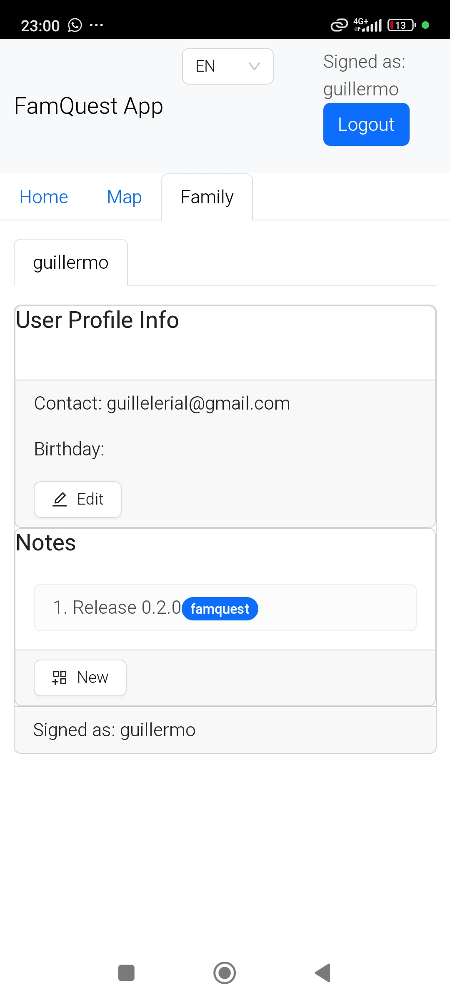

<h1>
  <a href="https://github.com/guigomcha/famquest/releases"></a>
</h1>

# The FamQuest App

A map guiding users on an adventure to uncover family memories and history shared in the form of a geo-location-based digital photo frame.

- See the documentation online in <https://info.famquest.guigomcha.dynv6.net> and continue reading the README files.
- There is a public instance for showcasing FamQuest which is re-seted everyday. Check it out <https://portal.demo.famquest.guigomcha.dynv6.net> and provide any feedback as an issue in Github. You will need a user and password, drop a message and I'll send it to you :).

As a Progressive Web App, Famquest can be used from browser and mobile. Most development has been done and tested via **Google Chrome and Edge** (for iOS, Android, Windows and Mac), other browsers could be used but have not been tested. Check a reference like [this one from 2023](https://firt.dev/notes/pwa/).

PWA features used:
- Geo-localization (optional).
- Image, video* and audio capture.
- Add to home screen (optional).
- App launching screen (optional).
- Service Workers (WIP)
- Web push notifications (WIP)

## Repo structure

- assets: Assets involved in the system as external git repos. Includes libraries, SDKs, repos for local reference...
- .github: CICD
- components: Source code of each custom component. Develop, install and test in isolation.
  - db-manager: Go API for the PostgreSQL and MINIO. Check the [README](./components/db-manager/README.md)
  - front-manager: React portal for a private custom instance of FamQuest. Check the [README](./components/front-manager/README.md).
  - welcome-page: React portal for the public information of FamQuest. Check the [README](./components/welcome-page/README.md)
  - backup-manager: Script-based service to push backups from PostgreSQL and MINIO to Dropbox and a local PVC. Check the [README](./components/backup-manager/README.md)
  - go-common: Go shared modules for all Go services. Check the [README](./components/go-common/README.md)
- deploy: Instructions to deploy components as part of the an E2E system including instructions to deploy opensource components which are required. Check the [README](./deploy/README.md).
- docs: Resources for docs
- external: Directory ignored to be able to host local git submodules of thirdparty software of interest but not extended by us.
- tools: Custom tools

## High Level description

"FamQuest" is born as the 1-year bday present for my first nephew, Jaime, with the initial objective of telling my story in his city as he discovers it (I live in a different city now).
It has eventually grown out to host the story of the whole family around the world, **as a location-based media-storage application** that is similar to a very private family photo album
and journal shared between family members, keeping it very clear that **this is not another social network**.
It is a way to share memories and pass them down in this new era of technology, lack of family time and globalization.

Some of the core objectives:  

- Your family members pre-populate your world with memories from their past. E.g., old family house, school, important trips, where the parents met...
- The target user has to physically be in a spot to visualize something (or proof it via google-maps). The map of the world is not fully visible, you have to discover it "fog-of-war-style" (age-of-empire). E.g., A notification alerts the user of a new spot found.
- Older generations have a way to quickly record an audio describing a spot or photo so that their voices are kept save and become available to be heard by future generations of the family.
- Keep lists of things that would be nice to be shared in a later time. E.g., Important movies, tips and tricks...
- Each family will be able to host their own instance of the application in an old laptop/miniPC without the need to sell their private memories to a big tech.

In the long term I want it to focus into a gamified-adulting app which provides the required knowledge to live in the modern world, focusing on those issues that the traditional schools do not provide (unfortunately):

- Government-related tasks.
- Take benefit of your city offers and surrounding.
- Do not fall for the same issues that have already happened in the history.
- Family-related nice-to-know and lessons learnt.
- ...

Why? I really want Jaime to get to the best starting-point when his adult live begins so that he can fight other battles and help beyond what most of us can do (because we need to do everything from scratch).

- Everyone struggles with the same paperwork and issues when we get (and lose) the first job, apply for scholarships...
- Society is not designed to simplify your life.
- Families do not know each other anymore but we all walk the same streets (at least during many years).
- Social media and tech industry is creating young adults who have not visited their own cities and surroundings because they are always on their phones in a sofa. This app enforces to leave the house while not enforcing the user to constantly check the app.
- ...

Which are the red lines here?

- This is not a social network app that wants to know you better to sell your info and flood you with adds.
- It is not going to be publicly available for "all your friends". This is a close-family (family means many things) app. Each family will host their own deployment with no external access from other users.
- ...

What could also be adapted to?
There is also the potential work as an app to assist migrants when they first arrive to a city in a new country. Gamifiying the FamQuest to complete the required tasks to be part of the
society, providing external tools, trick and tips etc.

## Low Level Description

The app is built in a cloud-native microservice-oriented architecture, leveraging open-source projects trying not to reinvent anything that already exist while ensuring that it can be hosted as cheaply as possible.
It is consumed as a Progressive Web App that can be used from a mobile or a laptop.

### Tech stack

- Front: React
- Back: Golang, Python

### Tech dependencies

- Nginx Reverse Proxy
- Let's Encrypt
- PostgreSQL
- Minio
- Keycloak
- Oauth-Proxy
- PgAdmin
- Prometheus
- Grafana
- Fluentd

### v0.3.0

- Portal
<p align="center">
  <div style="display: flex; overflow-x: scroll; width: 100%;">
    
    
    
    
    
    
    
  </div>
</p>

- Welcome Page
<p align="center">
  <div style="display: flex; overflow-x: scroll; width: 100%;">
    
    
    
    
  </div>
</p>

### v0.2.0

<p align="center">
  <div style="display: flex; overflow-x: scroll; width: 100%;">
    
    
    
    
    
    
    
  </div>
</p>

### v0.1.0

<p align="center">
  <div style="display: flex; overflow-x: scroll; width: 100%;">
    
    
    
    
    
  </div>
</p>

## Planning

All planning is centralized in the form of github milestones and associated-issues.
Any additional info is in the Wiki.

## Contribution

A Gitflow methodology is implemented within this repo. Proceed as follows:

1. Open an Issue, label appropriately and assign to the next planned release.
2. Pull the latest develop and branch off of it with a branch or PR created from Github.
3. After the first commit, open a DRAFT PR to develop.
4. Commit and push frequently.
5. When ready, set PR as ready, request review and wait for approval.

## License

Personal Public License to ensure that the project grows and receives contributions.

```text
                    GNU GENERAL PUBLIC LICENSE
                       Version 3, 29 June 2007

 Copyright (C) 2007 Free Software Foundation, Inc. <https://fsf.org/>
 Everyone is permitted to copy and distribute verbatim copies
 of this license document, but changing it is not allowed.

```
