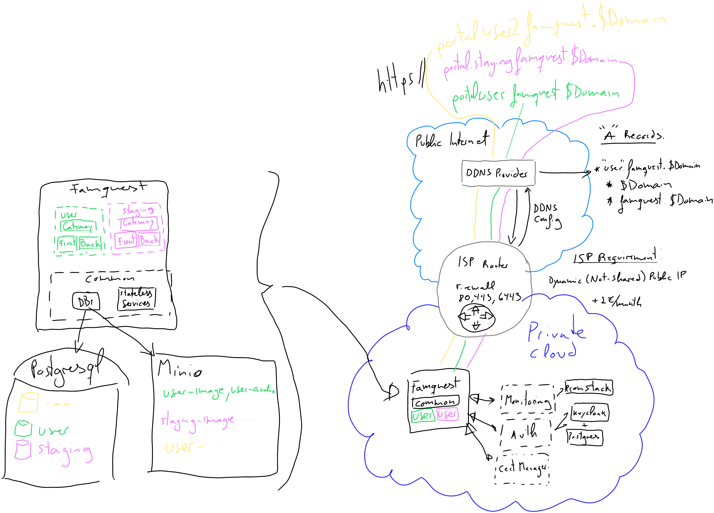
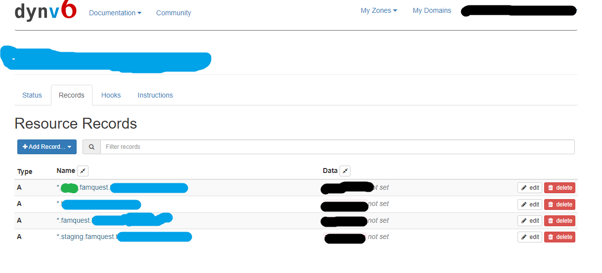

# Deploy and Use Guidelines

## Deploy

0. Follow the pre-requisites to set up a testbed as similar as possible to the one described there.

1. Search and replace in the codebase:
  
    - REPLACE@
    - REPLACE_USER
    - REPLACE_PASSWORD
    - REPLACE_BASE_DOMAIN
    - REPLACE_TARGET_USER
    - REPLACE_DDNS_TOKEN (Optional, use if dynv6 as DDNS)
    - REPLACE (for the keycloak details)
    - const isLocal = true; -> set to false

2. Build the images of all components (check their readmes.)

### K8s

Create the baseline secrets in the ns:

- common
- famquest
- REPLACE_TARGET_USER

```bash
kubectl create ns $namespace
kubectl create secret docker-registry guigomchasecrets --docker-server=https://ghcr.io --docker-username=REPLACE_USER --docker-password=REPLACE_PAT -n common
kubectl apply -f https://github.com/cert-manager/cert-manager/releases/download/v1.16.2/cert-manager.yaml
# install the monitoring stack
```

If your cluster cannot resolve public DNS, make sure the cert-manager and the oauth container in the gateway pod have this config

```yaml
    hostAliases:
      - hostnames:
        - api.REPLACE_BASE_DOMAIN
        - portal.REPLACE_TARGET_USER.famquest.REPLACE_BASE_DOMAIN
        - pgadmin.common.REPLACE_BASE_DOMAIN
        - minio.famquest.REPLACE_BASE_DOMAIN
        - minioapi.famquest.REPLACE_BASE_DOMAIN
        - auth.REPLACE_TARGET_USER.famquest.REPLACE_BASE_DOMAIN
        - grafana.common.REPLACE_BASE_DOMAIN
        - prometheus.common.REPLACE_BASE_DOMAIN
        - keycloak.common.REPLACE_BASE_DOMAIN
        ip: REPLACE_YOUR_PRIVATE_IP
```

Install the testbed common resources

```bash
kubectl apply -f deploy/k8s/common/postgresql.yaml -n common
kubectl apply -f deploy/k8s/common/keycloak.yaml -n common
kubectl apply -f deploy/k8s/common/pgadmin.yaml -n common
helm install gateway  OCI://ghcr.io/guigomcha/famquest/gateway --version 1.3.0 -n common -f deploy/k8s/common/values.yaml
# If you use dynv6 (see pre-requisites) as DDNS, then also deploy
kubectl apply -f deploy/k8s/common/dynv6-cronjob.yaml -n common
```

Install the backends

```bash
kubectl apply -f deploy/k8s/dbs/minio.yaml -n famquest
kubectl apply -f deploy/k8s/dbs/postgresql.yaml -n famquest
helm install gateway  OCI://ghcr.io/guigomcha/famquest/gateway --version 1.3.0 -n famquest -f deploy/k8s/dbs/values.yaml
kubectl apply -f deploy/k8s/components/gateway-cm.yaml -n famquest
kubectl rollout restart deployment -n famquest gateway-deployment
```

- Create the realm, openid connect client with an "audience" mapper in a custom scope
- Get keys and tokens for auth

```bash
# e.g., create Oauth secretToken
dd if=/dev/urandom bs=32 count=1 2>/dev/null | base64 | tr -d -- '\n' | tr -- '+/' '-_';
```

- Create also the REPLACE_TARGET_USER db (<https://pgadmin.common.REPLACE_BASE_DOMAIN>).

- Go inside minio (<https://minio.famquest.REPLACE_BASE_DOMAIN>) and create a user "REPLACE_TARGET_USER" with password "REPLACE_PASSWORD" and read/write permission

- Adapt the remaining manifests

```bash
kubectl apply -f deploy/k8s/components/dbmanager.yaml -n REPLACE_TARGET_USER
kubectl apply -f deploy/k8s/components/frontmanager.yaml -n REPLACE_TARGET_USER
kubectl apply -f deploy/k8s/components/backupmanager-cronjob.yaml # namespace is inside due to manifest conflicts
# Note: the current values and confimap overlay expect to have the monitoring stack already installed
helm install gateway  OCI://ghcr.io/guigomcha/famquest/gateway --version 1.3.0 -n REPLACE_TARGET_USER -f deploy/k8s/components/values.yaml
kubectl apply -f deploy/k8s/components/gateway-cm.yaml -n REPLACE_TARGET_USER
kubectl rollout restart deployment -n REPLACE_TARGET_USER gateway-deployment
```

Refs:

- <https://dev.to/ileriayo/adding-free-ssltls-on-kubernetes-using-certmanager-and-letsencrypt-a1l#:~:text=Install%20Cert-manager%20onto%20your%20cluster%20Add%20LetsEncrypt%20as,by%20checking%20the%20cert-manager%20namespace%20for%20running%20pods>
- <https://fullstackdeveloper.guru/2022/03/16/how-to-set-up-keycloak-for-oauth2-client-credentials-flow/#:~:text=Below%20is%20the%20algorithm%20to%20set%20up%20client,7%3A%20Test%20You%20can%20download%20keycloak%20from%20here>

### Local (OUTDATED)

Docker-compose

Refs:

- <https://github.com/oauth2-proxy/oauth2-proxy/tree/master/contrib/local-environment>

## Pre-requisites

### Testbed description

You will need a k8s cluster to deploy everything.
My setup is (something similar might work):

  <p align="center">
    
  </p>

- Old HP laptop with a Ubuntu Desktop 24.04.1 LTS from a bootable USB <https://ubuntu.com/tutorials/install-ubuntu-desktop#1-overview>
- Public IP (not shared, does not have to be static) provided by DIGI (-1€/month)
  - Port forwarding for 80 (needed for TLS challenge), 443 (HTTPS), 6443 (K3s control plane)
- Free domain using <https://dynv6.com/>
  - wildcard A records for all subdomains needed (my k8s ingress is the one that does the redirecting)
    <p align="center">
      
    </p>

    - In blue -> REPLACE_BASE_DOMAIN
    - In green -> REPLACE_TARGET_USER
  - There is a cronjob that makes sure that the DDNS is updated (1 per minute)
- Standard single-node k3s installation

    ```bash
    curl -sfL https://get.k3s.io | INSTALL_K3S_EXEC="server" sh -s - --write-kubeconfig-mode=644 --tls-san=REPLACE_BASE_DOMAIN
    sudo k3s kubectl config view --raw > kubeconfig.yaml
    # Replace the ip with the REPLACE_BASE_DOMAIN and you can use that kubeconfig from outside
    ```

### Monitoring stack

There is a monitoring stack automatically available which is expected to exist by the default manifests

```bash
helm repo add prometheus-community https://prometheus-community.github.io/helm-charts
helm repo update
helm install promstack -n monitoring --create-namespace prometheus-community/kube-prometheus-stack
```

Get the password:

```bash
kubectl get secret promstack-grafana -o jsonpath="{.data.admin-password}" -n monitoring  | base64 --decode ; echo
```

(Optional as it is not used but it is helpful)

```bash
kubectl apply -f https://github.com/kubernetes-sigs/metrics-server/releases/latest/download/components.yaml
```

Refs:

- <https://github.com/prometheus-community/helm-charts/blob/main/charts/kube-prometheus-stack/README.md>

## Backups

### Manual generation

postgres famquest DB

```bash
kubectl exec -it -n famquest postgresql-deployment-59fcf6944d-kkvqn -- sh -c "mkdir -p backups && pg_dump -U REPLACE_USER -h localhost REPLACE_TARGET_USER > backups/backup-$(date +"%m-%d-%Y-%H-%M").sql"
kubectl cp --retries=-1 famquest/postgresql-deployment-59fcf6944d-kkvqn:backups backups
```

minio DB

```bash
kubectl exec -it minio-deployment-7cc89bb699-x9l88 -n famquest -- sh -c "mkdir -p /opt/bitnami/minio-client/backups && tar -czf /opt/bitnami/minio-client/backups/data-$(date +"%m-%d-%Y-%H-%M").tar.gz /data"
kubectl cp --retries=-1 famquest/minio-deployment-7cc89bb699-x9l88:/opt/bitnami/minio-client/backups backups
```

From the backup manager

```bash
kubectl apply -f deploy/k8s/utils/pvc-access-pod.yaml -n REPLACE_TARGET_USER
kubectl cp --retries=-1 REPLACE_TARGET_USER/pvc-access-pod:/backups backups
kubectl delete -f deploy/k8s/utils/pvc-access-pod.yaml -n REPLACE_TARGET_USER
```

### Load the backup manually

Postgres

```bash
kubectl cp backups/backups-postgresql/backup-postgresql-REPLACE_TARGET_USER-03-07-2025-04-30.sql famquest/postgresql-deployment-59fcf6944d-kkvqn:/
# Drop the tables (pgadmin)
kubectl exec -it -n famquest postgresql-deployment-59fcf6944d-kkvqn -- /bin/bash
psql -U REPLACE_USER -d REPLACE_TARGET_USER -f /backup-postgresql-REPLACE_TARGET_USER-03-07-2025-04-30.sql 
exit
```

Minio

```bash
kubectl cp backups/backups-minio/backup-minio-REPLACE_TARGET_USER-03-05-2025-00-30.tar.gz famquest/minio-deployment-7cc89bb699-x9l88:/opt/bitnami/minio-client/

kubectl exec -it -n famquest minio-deployment-7cc89bb699-x9l88 -- /bin/bash
tar -xzvf backup-minio-REPLACE_TARGET_USER-03-05-2025-00-30.tar.gz
# replace the original folder from /data/REPLACE_TARGET_USER-{image or audio} with the contents of /opt/bitnami/minio-client/data/REPLACE_TARGET_USER-{image or audio}
rm -rf data
rm -rf *.tar.gz
exit
```

## Upgrades

0. DB and Front replicas to 0
  
    ```bash
    kubectl scale --replicas=0 deployment -n REPLACE_TARGET_USER dbmanager-deployment 
    kubectl scale --replicas=0 deployment -n REPLACE_TARGET_USER frontmanager-deployment 
    ```

1. Backup of postgresql
2. Access to pgadmin and apply the sql script in components/db-manager/tools/$VERSION-migrations.sql
3. Push the new docker image for db and front manager
4. Scale to 1

    ```bash
    kubectl scale --replicas=1 deployment -n REPLACE_TARGET_USER dbmanager-deployment 
    kubectl scale --replicas=1 deployment -n REPLACE_TARGET_USER frontmanager-deployment 
    ```
